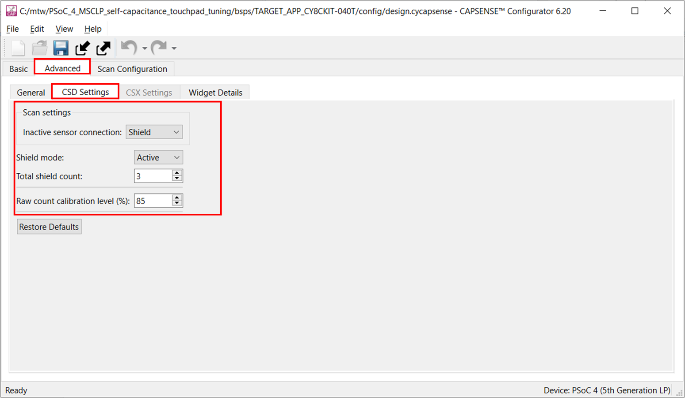
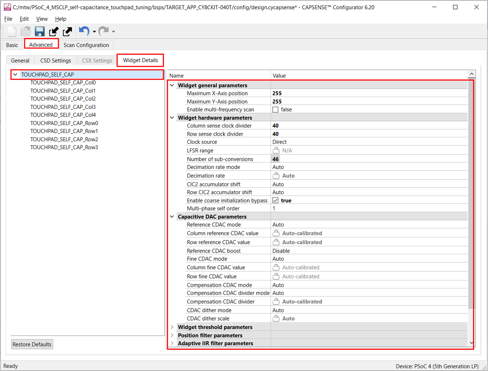
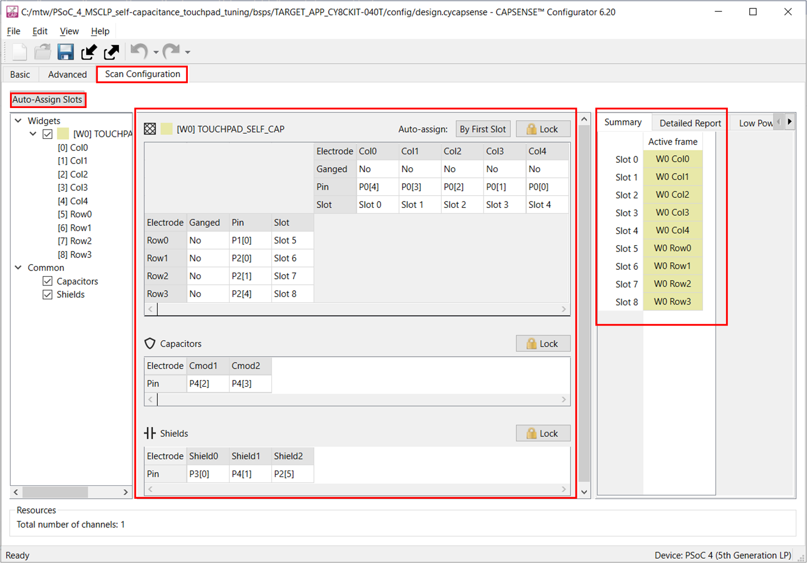
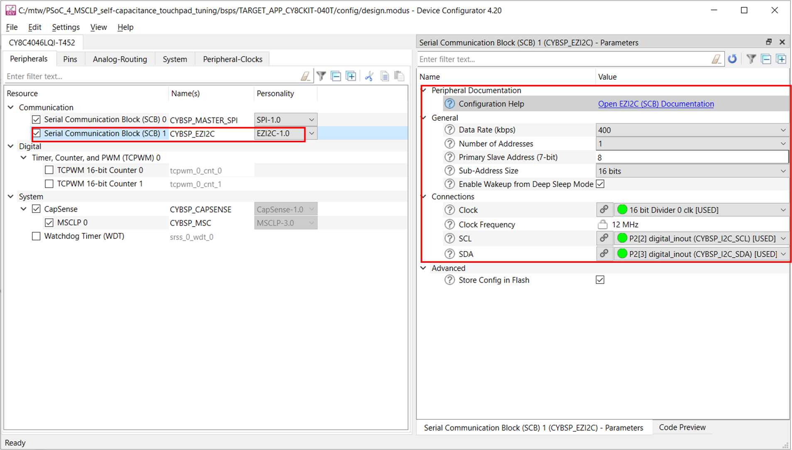

# PSoC&trade; 4: MSCLP self-capacitance touchpad tuning

This code example demonstrates how to use the CAPSENSE&trade; middleware to detect a finger touch position on a self-capacitance-based touchpad widget in PSoC&trade; 4000T device with multi-sense converter low-power (MSCLP).

In addition, this code example also explains how to manually tune the self-capacitance-based touchpad for optimum performance according to parameters such as reliability, power consumption, response time, and linearity using the CSD-RM sensing technique and CAPSENSE&trade; Tuner. Here, capacitive sigma-delta (CSD) represents the self-capacitance sensing technique and RM represents the ratiometric method.

[View this README on GitHub.](https://github.com/Infineon/mtb-example-psoc4-msclp-self-capacitance-touchpad)

[Provide feedback on this code example.](https://cypress.co1.qualtrics.com/jfe/form/SV_1NTns53sK2yiljn?Q_EED=eyJVbmlxdWUgRG9jIElkIjoiQ0UyMzUzMzgiLCJTcGVjIE51bWJlciI6IjAwMi0zNTMzOCIsIkRvYyBUaXRsZSI6IlBTb0MmdHJhZGU7IDQ6IE1TQ0xQIHNlbGYtY2FwYWNpdGFuY2UgdG91Y2hwYWQgdHVuaW5nIiwicmlkIjoieWFzaHZpIiwiRG9jIHZlcnNpb24iOiIzLjAuMCIsIkRvYyBMYW5ndWFnZSI6IkVuZ2xpc2giLCJEb2MgRGl2aXNpb24iOiJNQ0QiLCJEb2MgQlUiOiJJQ1ciLCJEb2MgRmFtaWx5IjoiUFNPQyJ9)

## Requirements

- [ModusToolbox&trade;](https://www.infineon.com/modustoolbox) v3.2 or later

   > **Note:** This code example version requires ModusToolbox&trade; version 3.2 or later, and is not backward compatible with v3.1 or older versions.

- Board support package (BSP) minimum required version: 3.2.0
- Programming language: C
- Associated parts: [PSoC&trade; 4000T](https://www.infineon.com/cms/en/product/microcontroller/32-bit-psoc-arm-cortex-microcontroller/psoc-4-32-bit-arm-cortex-m0-mcu/psoc-4000/psoc-4000t/)

## Supported toolchains (make variable 'TOOLCHAIN')

- GNU Arm&reg; Embedded Compiler v11.3.1 (`GCC_ARM`) – Default value of `TOOLCHAIN`
- Arm&reg; Compiler v6.16 (`ARM`)
- IAR C/C++ Compiler v9.30.1 (`IAR`)

## Supported kits (make variable 'TARGET')

- [PSoC&trade; 4000T CAPSENSE&trade; Evaluation Kit](https://www.infineon.com/CY8CKIT-040T) (`CY8CKIT-040T`) – Default value of `TARGET`

## Hardware setup

This example uses the board's default configuration. See the [kit user guide](https://www.infineon.com/002-34870) to ensure that the board is configured correctly to use VDDA at 1.8 V.

> **Note:** The PSoC&trade; 4 kits (except [CY8CKIT-040T](https://www.infineon.com/CY8CKIT-040T) and [CY8CKIT-041S-MAX](https://www.infineon.com/CY8CKIT-041s-max)) ship with KitProg2 installed. ModusToolbox&trade; requires KitProg3. Before using this code example, make sure that the board is upgraded to KitProg3. The tool and instructions are available in the [Firmware Loader](https://github.com/Infineon/Firmware-loader) GitHub repository. If you do not upgrade, you will see an error like "unable to find CMSIS-DAP device" or "KitProg firmware is out of date".

## Software setup

See the [ModusToolbox&trade; tools package installation guide](https://www.infineon.com/ModusToolboxInstallguide) for information about installing and configuring the tools package.

This example requires no additional software or tools.


## Using the code example

### Create the project

The ModusToolbox&trade; tools package provides the Project Creator as both a GUI tool and a command line tool.

<details><summary><b>Use Project Creator GUI</b></summary>

1. Open the Project Creator GUI tool.

   There are several ways to do this, including launching it from the dashboard or from inside the Eclipse IDE. For more details, see the [Project Creator user guide](https://www.infineon.com/ModusToolboxProjectCreator) (locally available at *{ModusToolbox&trade; install directory}/tools_{version}/project-creator/docs/project-creator.pdf*).

2. On the **Choose Board Support Package (BSP)** page, select a kit supported by this code example. See [Supported kits](#supported-kits-make-variable-target).

   > **Note:** To use this code example for a kit not listed here, you may need to update the source files. If the kit does not have the required resources, the application may not work.

3. On the **Select Application** page:

   a. Select the **Applications(s) Root Path** and the **Target IDE**.

   > **Note:** Depending on how you open the Project Creator tool, these fields may be pre-selected for you.

   b.	Select this code example from the list by enabling its check box.

   > **Note:** You can narrow the list of displayed examples by typing in the filter box.

   c. (Optional) Change the suggested **New Application Name** and **New BSP Name**.

   d. Click **Create** to complete the application creation process.

</details>

<details><summary><b>Use Project Creator CLI</b></summary>

The 'project-creator-cli' tool can be used to create applications from a CLI terminal or from within batch files or shell scripts. This tool is available in the *{ModusToolbox&trade; install directory}/tools_{version}/project-creator/* directory.

Use a CLI terminal to invoke the 'project-creator-cli' tool. On Windows, use the command-line 'modus-shell' program provided in the ModusToolbox&trade; installation instead of a standard Windows command-line application. This shell provides access to all ModusToolbox&trade; tools. You can access it by typing "modus-shell" in the search box in the Windows menu. In Linux and macOS, you can use any terminal application.

The following example clones the "[mtb-example-psoc4-msclp-self-capacitance-touchpad](https://github.com/Infineon/mtb-example-psoc4-msclp-self-capacitance-touchpad)" application with the desired name "MSCLPSelfCapTouchpadTuning" configured for the *CY8CKIT-040T* BSP into the specified working directory, *C:/mtb_projects*:

   ```
   project-creator-cli --board-id CY8CKIT-040T --app-id mtb-example-psoc4-msclp-self-capacitance-touchpad --user-app-name MSCLPSelfCapTouchpadTuning --target-dir "C:/mtb_projects"
   ```


The 'project-creator-cli' tool has the following arguments:

Argument | Description | Required/optional
---------|-------------|-----------
`--board-id` | Defined in the <id> field of the [BSP](https://github.com/Infineon?q=bsp-manifest&type=&language=&sort=) manifest | Required
`--app-id`   | Defined in the <id> field of the [CE](https://github.com/Infineon?q=ce-manifest&type=&language=&sort=) manifest | Required
`--target-dir`| Specify the directory in which the application is to be created if you prefer not to use the default current working directory | Optional
`--user-app-name`| Specify the name of the application if you prefer to have a name other than the example's default name | Optional

> **Note:** The project-creator-cli tool uses the `git clone` and `make getlibs` commands to fetch the repository and import the required libraries. For details, see the "Project creator tools" section of the [ModusToolbox&trade; tools package user guide](https://www.infineon.com/ModusToolboxUserGuide) (locally available at {ModusToolbox&trade; install directory}/docs_{version}/mtb_user_guide.pdf).

</details>


### Open the project

After the project has been created, you can open it in your preferred development environment.


<details><summary><b>Eclipse IDE</b></summary>

If you opened the Project Creator tool from the included Eclipse IDE, the project will open in Eclipse automatically.

For more details, see the [Eclipse IDE for ModusToolbox&trade; user guide](https://www.infineon.com/MTBEclipseIDEUserGuide) (locally available at *{ModusToolbox&trade; install directory}/docs_{version}/mt_ide_user_guide.pdf*).

</details>


<details><summary><b>Visual Studio (VS) Code</b></summary>

Launch VS Code manually, and then open the generated *{project-name}.code-workspace* file located in the project directory.

For more details, see the [Visual Studio Code for ModusToolbox&trade; user guide](https://www.infineon.com/MTBVSCodeUserGuide) (locally available at *{ModusToolbox&trade; install directory}/docs_{version}/mt_vscode_user_guide.pdf*).

</details>


<details><summary><b>Keil µVision</b></summary>

Double-click the generated *{project-name}.cprj* file to launch the Keil µVision IDE.

For more details, see the [Keil µVision for ModusToolbox&trade; user guide](https://www.infineon.com/MTBuVisionUserGuide) (locally available at *{ModusToolbox&trade; install directory}/docs_{version}/mt_uvision_user_guide.pdf*).

</details>


<details><summary><b>IAR Embedded Workbench</b></summary>

Open IAR Embedded Workbench manually, and create a new project. Then select the generated *{project-name}.ipcf* file located in the project directory.

For more details, see the [IAR Embedded Workbench for ModusToolbox&trade; user guide](https://www.infineon.com/MTBIARUserGuide) (locally available at *{ModusToolbox&trade; install directory}/docs_{version}/mt_iar_user_guide.pdf*).

</details>


<details><summary><b>Command line</b></summary>

If you prefer to use the CLI, open the appropriate terminal, and navigate to the project directory. On Windows, use the command-line 'modus-shell' program; on Linux and macOS, you can use any terminal application. From there, you can run various `make` commands.

For more details, see the [ModusToolbox&trade; tools package user guide](https://www.infineon.com/ModusToolboxUserGuide) (locally available at *{ModusToolbox&trade; install directory}/docs_{version}/mtb_user_guide.pdf*).

</details>


## Operation


1. Connect the board to your PC using the provided Micro-B USB cable through the KitProg3 USB connector as shown in **Figure 1**.

   **Figure 1. Connecting the [CY8CKIT-040T](https://www.infineon.com/CY8CKIT-040T) kit with the PC**

   

2. Program the board using one of the following:

   <details><summary><b>Using Eclipse IDE</b></summary>

      1. Select the application project in the Project Explorer.

      2. In the **Quick Panel**, scroll down, and click **\<Application Name> Program (KitProg3_MiniProg4)**.
   </details>


   <details><summary><b>In other IDEs</b></summary>

   Follow the instructions in your preferred IDE.
   </details>


   <details><summary><b>Using CLI</b></summary>

     From the terminal, execute the `make program` command to build and program the application using the default toolchain to the default target. The default toolchain is specified in the application's Makefile but you can override this value manually:
      ```
      make program TOOLCHAIN=<toolchain>
      ```

      Example:
      ```
      make program TOOLCHAIN=GCC_ARM
      ```
   </details>

3. After programming, the application starts automatically.

   > **Note:** After programming, you see the following error message if debug mode is disabled. This can be ignored or enabling the debug mode will solve this error.

   ``` c
   "Error: Error connecting Dp: Cannot read IDR"
   ```

4. To test the application, slide your finger over the CAPSENSE&trade; touchpad and notice that LED1 and LED3 turn ON with green color when touched, and turn OFF when the finger is lifted.

   - LED1 brightness increases when the finger is swiped from left to right.

   - LED3 brightness increases when the finger is swiped from bottom to top.

5. You can also monitor the CAPSENSE&trade; data using the CAPSENSE&trade; Tuner application as follows:

    **Monitor data using CAPSENSE&trade; Tuner**

    1. Open CAPSENSE&trade; Tuner from the tools section in the IDE **Quick Panel**.

        You can also run the CAPSENSE&trade; Tuner application in standalone mode from *{ModusToolbox&trade; install directory}/ModusToolbox/tools_{version}/capsense-configurator/capsense-tuner*. In this case, after opening the application, select **File** > **Open** and open the *design.cycapsense* file of the respective application, which is present in the *{Application root directory}/bsps/TARGET_APP_\<BSP-NAME>/config/* folder.

	 See the [ModusToolbox&trade; user guide](https://www.infineon.com/ModusToolboxUserGuide) (locally available at {*ModusToolbox&trade; install directory}/docs_{version}/mtb_user_guide.pdf*) for options to open the CAPSENSE&trade; Tuner application using the CLI.

    2. Ensure the kit is in CMSIS-DAP bulk mode (KitProg3 status LED is ON and not blinking). See [Firmware-loader](https://github.com/Infineon/Firmware-loader) to learn how to update the firmware and switch modes in KitProg3.

    3. In the tuner application, click on the **Tuner Communication Setup** icon or select **Tools** > **Tuner Communication Setup**. In the window, select I2C under KitProg3 and configure as follows:

         - **I2C address:** 8
         - **Sub-address:** 2-Bytes
         - **Speed (kHz):** 400

         These are the same values set in the EZI2C resource.

      **Figure 2. Tuner Communication Setup parameters**

      

6. Click **Connect** or select **Communication** > **Connect** to establish a connection.

   **Figure 3. Establish a connection**

   

7. Click **Start** or select **Communication** > **Start** to start data streaming from the device.

   **Figure 4. Start tuner communication**

   

   The tuner displays the data from the sensor in the **Widget View**, **Graph View**, and **Touchpad View** tabs.

8. Set the **Read mode** to **Synchronized** mode. Navigate to the **Widget View** tab and observe that the **TOUCHPAD_SELF_CAP** widget is highlighted in blue color when you touch it.

   **Figure 5. Widget view of the CAPSENSE&trade; Tuner**

   

9. You can view the raw count, baseline, difference count, status for each sensor, and touchpad position in the **Graph View** tab. For example, to view the sensor data for TOUCHPAD_SELF_CAP, select **TOUCHPAD_SELF_CAP_Col0** under **TOUCHPAD_SELF_CAP**.

   **Figure 6. Graph View tab of the CAPSENSE&trade; Tuner**

   

10. The **Touchpad View** tab shows the heatmap view and the finger movement can be visualized on the same.

      **Figure 7. Touchpad view of the CAPSENSE&trade; Tuner**

      

11. See the **Widget/Sensor Parameters** section in the CAPSENSE&trade; Tuner window. The configuration parameters for each touchpad sensor element calculated by the CAPSENSE&trade; resource are displayed as shown in **Figure 7**.

12. Verify that the signal-to-noise ratio (SNR) is greater than 5:1 and the signal count is above 50 by following the steps given in [Stage 3:  Obtain noise and crossover point](#stage-3-obtain-noise-and-crossover-point).

Non-reporting of false touches and the linearity of the position graph indicate proper tuning.


## Operation at other voltages

[CY8CKIT-040T kit](https://www.infineon.com/CY8CKIT-040T) supports operating voltages of 1.8 V, 3.3 V, and 5 V. Use voltage selection switch available on top of the kit to set the preferred operating voltage and see the [Set up the VDDA supply voltage and debug mode in Device Configurator](#set-up-the-vdda-supply-voltage-and-debug-mode-in-device-configurator) section.

This application functionalities are optimally tuned for 1.8 V. However, you can observe the basic functionalities working across other voltages. 

It is recommended to tune the application with the preferred voltages for better performance.

</details>

## Tuning procedure

### Create custom BSP for your board

1. Create a custom BSP for your board with any device by following the steps given in [ModusToolbox&trade; BSP Assistant user guide](https://www.infineon.com/ModusToolboxBSPAssistant). This code example is created for the CY8C4046LQI-T452 device.

2. Open the *design.modus* file from the *{Application root directory}/bsps/TARGET_APP_\<BSP-NAME>/config/* folder obtained in the previous step and enable CAPSENSE&trade; to get the *design.cycapsense* file. CAPSENSE&trade; configuration can be started from scratch as follows:

The following steps explain the tuning procedure.

> **Note:** See the "Selecting CAPSENSE&trade; hardware parameters" section in the [PSoC&trade; 4 and PSoC&trade; 6 MCU CAPSENSE&trade; design guide](https://www.infineon.com/AN85951) to learn about the considerations for selecting each parameter value.

**Figure 8. CSD touchpad widget tuning flow**


Do the following to tune the touchpad widget:

- [Stage 1: Set the initial hardware parameters](#stage-1-set-the-initial-hardware-parameters)

- [Stage 2: Set the sense clock frequency](#stage-2-set-the-sense-clock-frequency)

- [Stage 3: Obtain noise and crossover point](#stage-3-obtain-noise-and-crossover-point)

- [Stage 4: Fine-tune sensitivity to improve SNR](#stage-4-fine-tune-sensitivity-to-improve-snr)

- [Stage 5: Tune threshold parameters](#stage-5-tune-threshold-parameters)


### Stage 1: Set the initial hardware parameters
------------

1. Connect the board to your PC using the provided USB cable through the KitProg3 USB connector.

2. Launch the Device Configurator tool.

   You can launch the Device Configurator in Eclipse IDE for ModusToolbox&trade; from the **Tools** section in the IDE **Quick Panel** or in standalone mode from *{ModusToolbox&trade; install directory}/ModusToolbox/tools_{version}/device-configurator/device-configurator*. In this case, after opening the application, select **File** > **Open** and open the *design.modus* file of the respective application located in the *{Application root directory}/bsps/TARGET_APP_\<BSP-NAME>/config/* folder.

3. In the [PSoC&trade; 4000T kit](https://www.infineon.com/CY8CKIT-040T), the touchpad pins are connected to CAPSENSE&trade; channel (MSCLP 0). Therefore, ensure that you enable CAPSENSE&trade; channel in the **Device Configurator** as shown in **Figure 9**.

   **Figure 9. Enable MSCLP channel in the Device Configurator**

   

   Save the changes and close the window.

4. Launch the CAPSENSE&trade; Configurator tool.

   You can launch the CAPSENSE&trade; Configurator tool in the Eclipse IDE from the CAPSENSE&trade; **Peripherals** tab in the Device Configurator or directly from the **Tools** section in the IDE **Quick Panel**. You can also launch it in standalone mode from *{ModusToolbox&trade; install directory}/ModusToolbox/tools_{version}/capsense-configurator/capsense-configurator*. In this case, after opening the application, select **File** > **Open** and open the *design.cycapsense* file of the respective application located in the *{Application root directory}/bsps/TARGET_APP_\<BSP-NAME>/config/* folder.

   See the [ModusToolbox&trade; CAPSENSE&trade; Configurator tool guide](https://www.infineon.com/ModusToolboxCapSenseConfig) for step-by-step instructions on how to configure and launch CAPSENSE&trade; in ModusToolbox&trade;.

5. In the **Basic** tab, note that a single touchpad, **TOUCHPAD_SELF_CAP** is configured with CSD RM (self-cap) Sensing Mode.

   **Figure 10. CAPSENSE&trade; Configurator - Basic tab**

   

6. Go to **Advanced** > **General** tab and do the following:

   1. Select **CAPSENSE&trade; IMO Clock frequency** as **46** MHz.

   2. Set the **Modulator clock divider** to **1** to obtain the maximum available modulator clock frequency as recommended in the [PSoC&trade; 4 and PSoC&trade; 6 MCU CAPSENSE&trade; design guide](https://www.infineon.com/AN85951).

      > **Note:** The modulator clock frequency can be set to 46,000 kHz after changing the CAPSENSE&trade; IMO clock frequency to 46 MHz because the modulator clock is derived from the CAPSENSE&trade; IMO clock. In the **CAPSENSE&trade; IMO clock frequency** drop-down, select **46** MHz.

   3. Set the **Number of init sub-conversions** based on the hint shown when you hover over the edit box. Retain the default value.

   4. It is recommended to **Enable IIR filter (first order)** and set the **IIR filter raw count coefficient:** to **128** when the CIC2 filter is enabled. You can enable the filters later depending on the SNR requirements in [Stage 4: Fine-tune sensitivity to improve SNR](#stage-4-fine-tune-sensitivity-to-improve-snr).

      Filters are used to reduce the peak-to-peak noise; however, using filters will result in a longer scan time.

   **Figure 11. CAPSENSE&trade; Configurator – General settings**

   

   > **Note:** Each tab has a **Restore Defaults** button to restore the parameters of that tab to their default values.

7. Go to **CSD Settings** tab and make the following changes:

   - Set **Inactive sensor connection** as **Shield**.

      Inactive sensors connected to shield provide better performance in terms of SNR and refresh rate (as the use of shield results in a reduction of sensor capacitance C<sub>p</sub> and can be used if your design requires liquid tolerance).

   - Set **Shield mode** to **Active**.

      MSCLP provides active and passive shielding. Active shielding is preferred for high-performance applications. Before enabling this option, ensure that your design has shield electrodes.

   - Set **Total shield count** as **3**.

      To improve noise immunity, configure all unused sensor pins as shield.

    **Raw count calibration level(%)** helps in achieving the required CDAC calibration levels (85% of maximum count by default) for all sensors in the widget, while maintaining the same sensitivity across the sensor elements.
      This can be reduced, if application reaches the saturation level on a touch event.

   **Figure 12. CAPSENSE&trade; Configurator – Advanced CSD settings**

   

8. Go to the **Widget Details** tab. Select **TOUCHPAD_SELF_CAP** from the left pane and then set the following:

   1. **Maximum X-Axis position** and **Maximum Y-Axis position:** 255

   2. **Column sense clock divider:** Default value (will be set in [Stage 2: Set the sense clock frequency](#stage-2-set-the-sense-clock-frequency))

   3. **Row sense clock divider:** Retain the default value (will be set in [Stage 2: Set the sense clock frequency](#stage-2-set-the-sense-clock-frequency))

   4. **Clock source:** Direct

      > **Note:** Spread spectrum clock (SSC) or PRS clock can be used as a clock source to deal with EMI/EMC issues.

   5. **Number of sub-conversions:** 12

         The value '12' is an appropriate starting point to ensure a fast scan time and sufficient signal. This value will be adjusted as required in [Stage 4: Fine-tune sensitivity to improve SNR](#stage-4-fine-tune-sensitivity-to-improve-snr).

   6. **Finger threshold:** 20

       Finger threshold is initially set to a low value which allows the **Touchpad View** to track the finger movement during tuning.

   7. **Noise threshold:** 10

   8. **Negative noise threshold:** 10

   9. **Hysteresis:** 5

     These values reduce the influence of the baseline on the sensor signal which helps to get the true difference count. Retain the default values for all other threshold parameters; these parameters are set in [Stage 5: Tune threshold parameters](#stage-5-tune-threshold-parameters).

   **Figure 13. CAPSENSE&trade; Configurator - Widget Details settings**

   

9. To select pins and scan slots, go to **Scan Configuration** tab and do the following:

   **Figure 14. Scan Configuration tab**

   

   1. Configure pins for the electrodes using the drop-down menu.

   2. Configure the scan slots using **Auto-Assign Slots** option.

      The summary section in the **Scan Configuration** tab shows nine scan slots (for nine sensors). Each sensor is allotted a scan slot based on the slot number.

   3. Check the notice list for warnings or errors.

      > **Note:** Enable the **Notice List** from the **View** menu if the notice list is not visible.

10. Click **Save** to apply the settings.


### Stage 2: Set the sense clock frequency
-----------------

The sense clock is derived from the modulator clock using a clock-divider and is used to scan the sensor by driving the CAPSENSE&trade; switched-capacitor circuits. Both the clock source and clock divider are configurable. The sense clock divider should be configured such that the pulse width of the sense clock is long enough to allow the sensor capacitance to charge and discharge completely. This is verified by observing the charging and discharging waveforms of the sensor using an oscilloscope and an active probe. The sensors should be probed close to the electrode and not at the sense pins or the series resistor. 

See **Figure 15** and **Figure 16** for waveforms observed on the shield. **Figure 15** shows proper charging when the sense clock frequency is correctly tuned. The pulse width is at least 5 Tau, i.e., the voltage is reaching at least 99.3% of the required voltage at the end of each phase. **Figure 16** shows incomplete settling (charging/discharging).


**Figure 15. Proper charge cycle of a sensor**


**Figure 16. Improper charge cycle of a sensor**


1. Program the board and launch CAPSENSE&trade; Tuner.

2. See the charging waveform of the sensor as described earlier. 

3. If the charging is incomplete, increase the sense clock divider. Do this in CAPSENSE&trade; Tuner by selecting the sensor and editing the sense clock divider parameter in the Widget/Sensor Parameters panel.

    > **Note:** The sense clock divider should be **divisible by 4**. This ensures that all four scan phases have equal durations. 

   After editing the value, click the **Apply to Device** button and observe the waveform again. Repeat this until complete settling is observed.  
   
4. Click the **Apply to Project** button so that the configuration is saved to your project. 

   **Figure 17. Sense clock divider setting**

   
   

5. Repeat this process for all the sensors and the shield. Each sensor may require a different sense clock divider value to charge/discharge completely. But all the sensors that are in the same scan slot need to have the same sense clock source, sense clock divider, and number of sub-conversions. Therefore, take the largest sense clock divider in a given scan slot and apply it to all the other sensors that share that slot.


### Stage 3: Obtain noise and crossover point 
---------------

To obtain the noise and crossover point, do the following:

1. Program the board.

2.  Launch the CAPSENSE&trade; Tuner to monitor the CAPSENSE&trade; data and for CAPSENSE&trade; parameter tuning and SNR measurement.

    See the [CAPSENSE&trade; Tuner guide](https://www.infineon.com/ModusToolboxCapSenseTuner) for step-by-step instructions on how to launch and configure the CAPSENSE&trade; Tuner in ModusToolbox&trade;.


3. Capture the raw counts of each sensor element in the touchpad as shown in **Figure 18** and verify that they are approximately equal to 85% (± 5%) of the MaxCount. See [AN234231 - Achieving lowest-power capacitive sensing with PSoC&trade; 4000T](https://www.infineon.com/AN234231) for the MaxCount equation.

   1. Go to the **Touchpad View** tab and change the **Display settings** as follows:

      - **Display mode:** Touch reporting

      - **Data type:** RawCount

      - **Value type:** Current

      - **Number of samples:** 1000

   **Figure 18. Raw counts obtained on the Touchpad View tab in the Tuner window**

   

4. Observe and note the peak-to-peak noise of each sensor element in the touchpad.

   1. From the **Widget Explorer** section, select the widget *TOUCHPAD_SELF_CAP*.

   2. Go to the **Touchpad View** tab and change the **Display settings** as follows:

      - **Display mode:** Touch reporting

      - **Data type:** RawCount

      - **Value type:** Max-Min

      - **Number of samples:** 1000

   **Figure 19. Noise obtained on the Touchpad View tab in the Tuner window**

   


      See the row and column having the highest raw counts without placing a finger (which gives the peak-to-peak noise) in the **Touchpad View**.
      
   3. Capture the accurate noise by following these steps: 

      a) Click on the highest value observed in the heatmap for Row.

      b) Click on **SNR Measurement** tab.

      c) Click on **Acquire Noise**.

      d) Repeat the above steps for the column as well.

     **Figure 20. Row noise obtained on the SNR Measurement tab in Tuner window**

    

    

    **Figure 21. Column noise obtained on the SNR Measurement tab in Tuner window**

    
   
   

   **Table 1. Maximum peak-to-peak noise obtained in CY8CKIT-040T kit**

   Kit | Maximum peak-to-peak noise for row sensors| Maximum peak-to-peak noise for column sensors
   :----------|:-------------------------| :------
   CY8CKIT-040T   | 212 | 125 
   
   <br>
   
5. Observe the sensor signal in the **Graph View** tab in the **Sensor Signal** graph display.

   a) Select the columns in **Widget Explorer** as shown in **Figure 22**. 
   
   b) Firmly swipe the finger (6 mm) horizontally on the touchpad in the **least touch intensity (LTI)** position.

   c) Note the lowest crossover point observed under **Sensor Signal**.

   d) Repeat the above steps for row by swiping the finger vertically on the touchpad in the LTI position.

   > **Note:** The LTI signal is measured at the farthest point (not at the last column/row) of the touchpad from the sensor pin connection, where the sensors have the worst case RC-time constant.

   **Figure 22. Column signal obtained on the Graph View tab in Tuner window**

    
    
    

    **Figure 23. Row signal obtained on the Graph View tab in Tuner window**

    
   
   

   **Table 2. Sensor signal obtained in [CY8CKIT-040T](https://www.infineon.com/CY8CKIT-040T) kit**

   Kit | LTI signal for row sensors| LTI signal for column sensors
   :----------|:-------------------------| :------
   CY8CKIT-040T   | 1329 | 1330
 
 <br>

### Stage 4: Fine-tune sensitivity to improve SNR
------------------

The CAPSENSE&trade; system may be required to work reliably in adverse conditions, such as a noisy environment. The touchpad sensors need to be tuned with SNR greater than 5:1 to avoid triggering false touches and to make sure that all intended touches are registered in these adverse conditions.

> **Note:** For gesture detection, it is recommended to have around 10:1 SNR.

1. Ensure that the LTI signal count is greater than 50 and meets at least 5:1 SNR (using **Equation 1**).

   In CAPSENSE&trade; Tuner window, increase the **Number of sub-conversions** (located in **Widget Hardware Parameters** > **Widget/Sensor Parameters** section) by **10** until you achieve at least 5:1 SNR.

   **Equation 1. SNR**

   

   Where,

   - LTI signal is the signal obtained as shown in **Figure 22** and **Figure 23**

   - Pk-Pk noise is the peak-to-peak noise obtained as shown in **Figure 20** and **Figure 21**

   SNR is measured for row sensors and column sensors separately, using **Equation 1**.

   From the values derived from figures mentioned earlier, an example SNR calculation can be calculated as:

   SNR of column sensors = 1330/125 = 10.64; SNR of row sensors = 1329/212 = 6.26.

2. Update the number of sub-conversions.

   1. Update the **Number of sub-conversions (Nsub)** directly in the **Widget/Sensor parameters** tab of the CAPSENSE&trade; Tuner.

   2. [CY8CKIT-040T](https://www.infineon.com/CY8CKIT-040T) kit has an in-built CIC2 filter which increases the resolution for the same scan time. See [AN234231 - Achieving lowest-power capacitive sensing with PSoC&trade; 4000T](https://www.infineon.com/AN234231) for detailed information on the CIC2 filter.

   3. Current consumption is directly proportional to the number of sub-conversions; therefore, decrease the number of sub-conversions to achieve lower current consumption.

      > **Note:** The number of sub-conversions should be greater than or equal to 8, and they should not be increased beyond a certain limit such that the raw count does not increase more than 2<sup>16</sup> (as it is a 16-bit counter).

3. After changing the **Number of sub-conversions**, click **Apply to Device** to send the setting to the device. The change is reflected in the graphs.

   > **Note:** The **Apply to Device** option is enabled only when the **Number of sub-conversions** is changed.

> **Note:** Decrease the IIR filter coefficient if 5:1 SNR is not being achieved even with maximum Nsub.


### Stage 5: Tune threshold parameters
---------------

After confirming that your design meets the timing parameters and the SNR is greater than 5:1, set your threshold parameters.

> **Note:** Thresholds are set based on the LTI position because it is the least valid touch signal that can be obtained.

1. Set the recommended threshold values for the touchpad widget using the LTI signal value obtained in [Stage 4: Fine-tune sensitivity to improve SNR](#stage-4-fine-tune-sensitivity-to-improve-snr).

   - **Finger threshold** – 80% of the lower LTI signal (either Row or Column)

   - **Noise threshold** – Twice the highest noise or 40% of the lower LTI signal (whichever is greater)

   - **Negative noise threshold** – Twice the highest noise or 40% of the lower LTI signal (whichever is greater)

   - **Hysteresis** – 10% of the lower LTI signal

   - **ON debounce** – '10' (set to '1' for gesture detection)

   - **Low baseline reset** – Default value of '30'

   - **Velocity** – Default value of '2500'

       > **Note:** The 'Velocity' parameter is not required for single finger detection.

   **Table 3. Software tuning parameters obtained for [CY8CKIT-040T](https://www.infineon.com/CY8CKIT-040T)** kit

   Parameter|	 [CY8CKIT-040T](https://www.infineon.com/CY8CKIT-040T) kit
   :--------|:------
   Number of sub-conversions	| 46	
   Decimation rate	| 255 
   Finger threshold 	| 1064 
   Noise threshold | 532 
   Negative noise threshold	| 532 
   Hysteresis	| 133 
   ON debounce	| 10 
   Low baseline reset	| 30

<br>

### Apply the settings to the firmware

Click **Apply to Device** and **Apply to Project** in the CAPSENSE&trade; Tuner window to apply the settings to the device and project respectively. Close the tuner.

   **Figure 24. Apply to project**

   

   The change is updated in the *design.cycapsense* file and reflected in the CAPSENSE&trade; Configurator.


## Debugging

You can debug the example to step through the code.


<details><summary><b>In Eclipse IDE</b></summary>

Use the **\<Application Name> Debug (KitProg3_MiniProg4)** configuration in the **Quick Panel**. For details, see the "Program and debug" section in the [Eclipse IDE for ModusToolbox&trade; user guide](https://www.infineon.com/MTBEclipseIDEUserGuide).


</details>


<details><summary><b>In other IDEs</b></summary>

Follow the instructions in your preferred IDE.

</details>


By default, the debug option is disabled in the Device Configurator. To enable the debug option, see the [Set up VDDA supply and debug mode in Device Configurator](#set-up-the-vdda-supply-voltage-and-debug-mode-in-device-configurator) section. To achieve low-power consumption, it is recommended to disable it.


## Design and implementation

The project contains a touchpad widget configured in CSD-RM Sensing mode. See the [Tuning procedure](#tuning-procedure) section for step-by-step instructions to configure the other settings of the CAPSENSE&trade; Configurator.

The project uses the [CAPSENSE&trade; middleware](https://github.com/Infineon/capsense) (see ModusToolbox&trade; user guide for more details on selecting a middleware). See [AN85951 – PSoC&trade; 4 and PSoC&trade; 6 MCU CAPSENSE&trade; design guide](https://www.infineon.com/AN85951) for more details on CAPSENSE&trade; features and usage.

[ModusToolbox&trade;](https://www.infineon.com/modustoolbox) provides a GUI-based tuner application for debugging and tuning the CAPSENSE&trade; system. The CAPSENSE&trade; Tuner application works with EZI2C and UART communication interfaces. This project has an SCB block configured in EZI2C mode to establish communication with the onboard KitProg, which in turn enables reading the CAPSENSE&trade; raw data by the CAPSENSE&trade; Tuner; see **Figure 27**.

The CAPSENSE&trade; data structure that contains the CAPSENSE&trade; raw data is exposed to the CAPSENSE&trade; Tuner by setting up the I2C communication data buffer with the CAPSENSE&trade; data structure. This enables the tuner to access the CAPSENSE&trade; raw data for tuning and debugging CAPSENSE&trade;.

The successful tuning of the touchpad is indicated by the RGB LED in the Evaluation Kit; the LED1 brightness increases when the finger is swiped from left to right, and the LED3 brightness increases when the finger is swiped from bottom to top on the touchpad.

The master output slave input (MOSI) pin of the SPI slave peripheral is used to transfer data to the three serially connected LEDs for controlling color, brightness, and ON or OFF operations. The three LEDs form a daisy-chain connection and communication happens over the serial interface to create an RGB configuration. The LED accepts a 8-bit input code, with three bytes for red, green, and blue color, five bits for global brightness, and three blank '1' bits. See the [LED datasheet](https://media.digikey.com/pdf/Data%20Sheets/Everlight%20PDFs/12-23C_RSGHBHW-5V01_2C_Rev4_12-17-18.pdf) for more details.


### Set up the VDDA supply voltage and debug mode in Device Configurator

1. Open Device Configurator from the **Quick Panel**.

2. Go to the **System** tab. Select the **Power** resource and set the VDDA value under **Operating Conditions** as shown in **Figure 25**.

   **Figure 25. Setting the VDDA supply in the System tab of Device Configurator**

   

3. By default, the debug mode is disabled for this application to reduce power consumption. Enable the debug mode to enable the SWD pins as shown in **Figure 26**.

   **Figure 26. Enable debug mode in the System tab of Device Configurator**

   


### Resources and settings

**Figure 27. EZI2C settings**




**Figure 28. SPI settings**


**Table 4. Application resources**

 Resource  |  Alias/object     |    Purpose     
 :------- | :------------    | :------------ 
 SCB (EZI2C) (PDL) | CYBSP_EZI2C          | EZI2C slave driver to communicate with CAPSENSE&trade; Tuner
 CAPSENSE&trade; | CYBSP_MSC | CAPSENSE&trade; driver to interact with the MSCLP hardware and interface the CAPSENSE&trade; sensors 
 Digital pin     | CYBSP_SERIAL_LED | To show the touchpad operation
 SCB (SPI) (PDL) | CYBSP_MASTER_SPI | SPI master driver to drive the serial LED which visualizes touchpad response


<br>

### Firmware flow

**Figure 29. Firmware flowchart**


## Related resources

Resources  | Links
-----------|----------------------------------
Application notes  | [AN79953](https://www.infineon.com/AN79953) – Getting started with PSoC&trade; 4 <br> [AN85951](https://www.infineon.com/AN85951) – PSoC&trade; 4 and PSoC&trade; 6 MCU CAPSENSE&trade; design guide <br> [AN234231](https://www.infineon.com/AN234231) – Achieving lowest-power capacitive sensing with PSoC&trade; 4000T
Code examples | [Using ModusToolbox&trade;](https://github.com/Infineon/Code-Examples-for-ModusToolbox-Software) on GitHub
Device documentation | [PSoC&trade; 4 datasheets](https://www.infineon.com/cms/en/search.html#!term=psoc%204%20datasheet&view=all) <br>[PSoC&trade; 4 technical reference manuals](https://www.infineon.com/cms/en/search.html#!term=psoc%204%20TRM&view=all)
Development kits | Select your kits from the [Evaluation board finder](https://www.infineon.com/cms/en/design-support/finder-selection-tools/product-finder/evaluation-board).
Libraries on GitHub  | [mtb-hal-cat2](https://github.com/Infineon/mtb-hal-cat2) – Hardware Abstraction Layer (HAL) library
Middleware on GitHub | [capsense](https://github.com/Infineon/capsense) – CAPSENSE&trade; library and documents
Tools  | [ModusToolbox&trade;](https://www.infineon.com/modustoolbox) – ModusToolbox&trade; software is a collection of easy-to-use libraries and tools enabling rapid development with Infineon MCUs for applications ranging from wireless and cloud-connected systems, edge AI/ML, embedded sense and control, to wired USB connectivity using PSoC&trade; Industrial/IoT MCUs, AIROC&trade; Wi-Fi and Bluetooth&reg; connectivity devices, XMC&trade; Industrial MCUs, and EZ-USB&trade;/EZ-PD&trade; wired connectivity controllers. ModusToolbox&trade; incorporates a comprehensive set of BSPs, HAL, libraries, configuration tools, and provides support for industry-standard IDEs to fast-track your embedded application development.

<br>


## Other resources


Infineon provides a wealth of data at [www.infineon.com](https://www.infineon.com) to help you select the right device, and quickly and effectively integrate it into your design.


## Document history

Document title: *CE235338* - *PSoC&trade; 4: MSCLP self-capacitance touchpad tuning*

 Version | Description of change
 ------- | ---------------------
 1.0.0   | New code example <br> This version is not backward compatible with ModusToolbox&trade; v2.4
 1.1.0   | Minor folder structure changes that does not break backward compatibility
 2.0.0   | Major update to support ModusToolbox&trade; v3.1 <br> This version is not backward compatible with ModusToolbox&trade; v3.0
 2.0.1   | Minor configuration and readme update
 3.0.0   | Major update to support ModusToolbox&trade; v3.2 and CAPSENSE&trade; Middleware v5.0<br> This version is not backward compatible with ModusToolbox&trade; v3.1
<br>


All referenced product or service names and trademarks are the property of their respective owners.

The Bluetooth&reg; word mark and logos are registered trademarks owned by Bluetooth SIG, Inc., and any use of such marks by Infineon is under license.


---------------------------------------------------------

© Cypress Semiconductor Corporation, 2022-2023. This document is the property of Cypress Semiconductor Corporation, an Infineon Technologies company, and its affiliates ("Cypress").  This document, including any software or firmware included or referenced in this document ("Software"), is owned by Cypress under the intellectual property laws and treaties of the United States and other countries worldwide.  Cypress reserves all rights under such laws and treaties and does not, except as specifically stated in this paragraph, grant any license under its patents, copyrights, trademarks, or other intellectual property rights.  If the Software is not accompanied by a license agreement and you do not otherwise have a written agreement with Cypress governing the use of the Software, then Cypress hereby grants you a personal, non-exclusive, nontransferable license (without the right to sublicense) (1) under its copyright rights in the Software (a) for Software provided in source code form, to modify and reproduce the Software solely for use with Cypress hardware products, only internally within your organization, and (b) to distribute the Software in binary code form externally to end users (either directly or indirectly through resellers and distributors), solely for use on Cypress hardware product units, and (2) under those claims of Cypress's patents that are infringed by the Software (as provided by Cypress, unmodified) to make, use, distribute, and import the Software solely for use with Cypress hardware products.  Any other use, reproduction, modification, translation, or compilation of the Software is prohibited.
<br>
TO THE EXTENT PERMITTED BY APPLICABLE LAW, CYPRESS MAKES NO WARRANTY OF ANY KIND, EXPRESS OR IMPLIED, WITH REGARD TO THIS DOCUMENT OR ANY SOFTWARE OR ACCOMPANYING HARDWARE, INCLUDING, BUT NOT LIMITED TO, THE IMPLIED WARRANTIES OF MERCHANTABILITY AND FITNESS FOR A PARTICULAR PURPOSE.  No computing device can be absolutely secure.  Therefore, despite security measures implemented in Cypress hardware or software products, Cypress shall have no liability arising out of any security breach, such as unauthorized access to or use of a Cypress product. CYPRESS DOES NOT REPRESENT, WARRANT, OR GUARANTEE THAT CYPRESS PRODUCTS, OR SYSTEMS CREATED USING CYPRESS PRODUCTS, WILL BE FREE FROM CORRUPTION, ATTACK, VIRUSES, INTERFERENCE, HACKING, DATA LOSS OR THEFT, OR OTHER SECURITY INTRUSION (collectively, "Security Breach").  Cypress disclaims any liability relating to any Security Breach, and you shall and hereby do release Cypress from any claim, damage, or other liability arising from any Security Breach.  In addition, the products described in these materials may contain design defects or errors known as errata which may cause the product to deviate from published specifications. To the extent permitted by applicable law, Cypress reserves the right to make changes to this document without further notice. Cypress does not assume any liability arising out of the application or use of any product or circuit described in this document. Any information provided in this document, including any sample design information or programming code, is provided only for reference purposes.  It is the responsibility of the user of this document to properly design, program, and test the functionality and safety of any application made of this information and any resulting product.  "High-Risk Device" means any device or system whose failure could cause personal injury, death, or property damage.  Examples of High-Risk Devices are weapons, nuclear installations, surgical implants, and other medical devices.  "Critical Component" means any component of a High-Risk Device whose failure to perform can be reasonably expected to cause, directly or indirectly, the failure of the High-Risk Device, or to affect its safety or effectiveness.  Cypress is not liable, in whole or in part, and you shall and hereby do release Cypress from any claim, damage, or other liability arising from any use of a Cypress product as a Critical Component in a High-Risk Device. You shall indemnify and hold Cypress, including its affiliates, and its directors, officers, employees, agents, distributors, and assigns harmless from and against all claims, costs, damages, and expenses, arising out of any claim, including claims for product liability, personal injury or death, or property damage arising from any use of a Cypress product as a Critical Component in a High-Risk Device. Cypress products are not intended or authorized for use as a Critical Component in any High-Risk Device except to the limited extent that (i) Cypress's published data sheet for the product explicitly states Cypress has qualified the product for use in a specific High-Risk Device, or (ii) Cypress has given you advance written authorization to use the product as a Critical Component in the specific High-Risk Device and you have signed a separate indemnification agreement.
<br>
Cypress, the Cypress logo, and combinations thereof, ModusToolbox, PSoC, CAPSENSE, EZ-USB, F-RAM, and TRAVEO are trademarks or registered trademarks of Cypress or a subsidiary of Cypress in the United States or in other countries. For a more complete list of Cypress trademarks, visit www.infineon.com. Other names and brands may be claimed as property of their respective owners.
