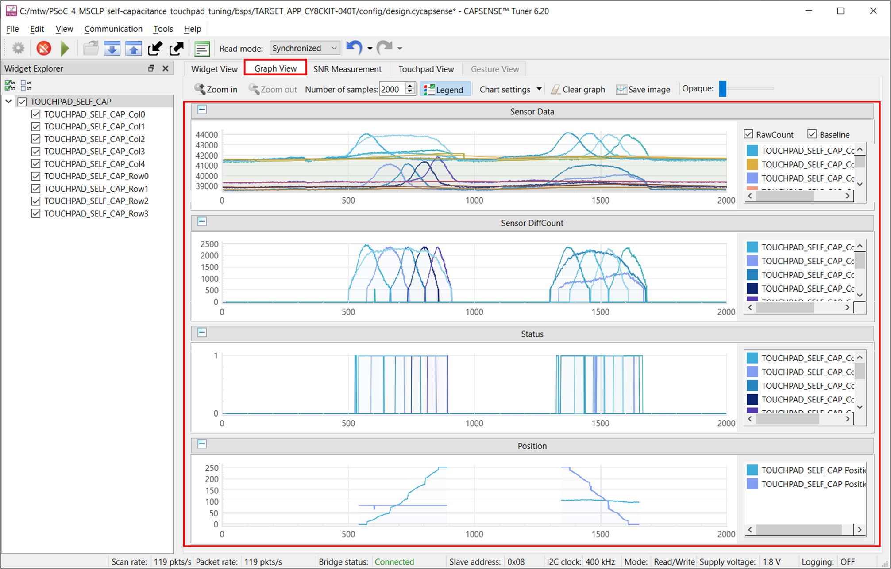
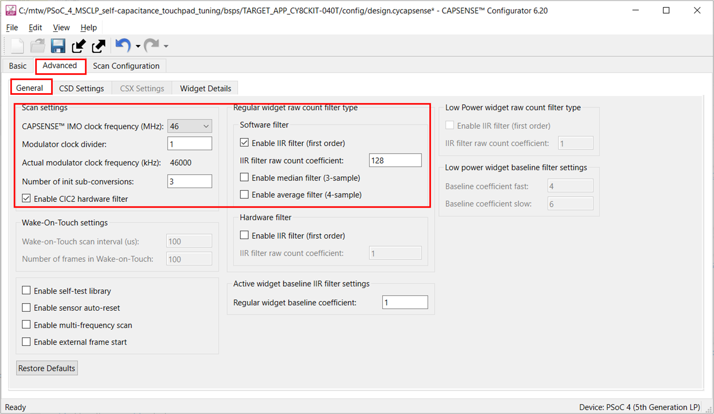
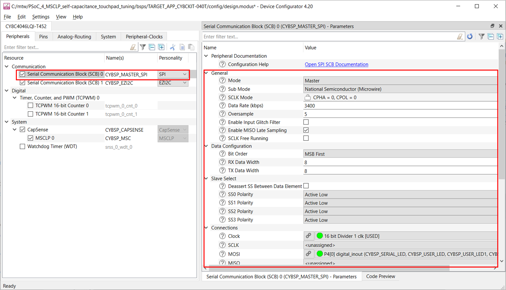

# PSoC&trade; 4: MSCLP self-capacitance touchpad tuning

This code example demonstrates how to use the CAPSENSE&trade; middleware to detect a finger touch position on a self-capacitance-based touchpad widget in PSoC&trade; 4000T device with multi-sense converter low power (MSCLP).

In addition, this code example also explains how to manually tune the self-capacitance-based touchpad for optimum performance with respect to parameters such as reliability, power consumption, response time, and linearity using the CSD-RM sensing technique and CAPSENSE&trade; Tuner. Here, CAPSENSE&trade; Sigma Delta (CSD) represents the self-capacitance sensing technique and RM represents the ratiometric method.

[View this README on GitHub.](https://github.com/Infineon/mtb-example-psoc4-msclp-self-capacitance-touchpad)

[Provide feedback on this code example.](https://cypress.co1.qualtrics.com/jfe/form/SV_1NTns53sK2yiljn?Q_EED=eyJVbmlxdWUgRG9jIElkIjoiQ0UyMzUzMzgiLCJTcGVjIE51bWJlciI6IjAwMi0zNTMzOCIsIkRvYyBUaXRsZSI6IlBTb0MmdHJhZGU7IDQ6IE1TQ0xQIHNlbGYtY2FwYWNpdGFuY2UgdG91Y2hwYWQgdHVuaW5nIiwicmlkIjoieWFzaHZpIiwiRG9jIHZlcnNpb24iOiIxLjEuMCIsIkRvYyBMYW5ndWFnZSI6IkVuZ2xpc2giLCJEb2MgRGl2aXNpb24iOiJNQ0QiLCJEb2MgQlUiOiJJQ1ciLCJEb2MgRmFtaWx5IjoiUFNPQyJ9)

## Requirements

- [ModusToolbox&trade; software](https://www.infineon.com/modustoolbox) v3.0 or later

   **Note:** This code example version requires ModusToolbox&trade; software version 3.0 or later, and is not backward compatible with v2.4 or older versions.

- Board support package (BSP) minimum required version: 0.6.0
- Programming language: C
- Associated parts: PSoC&trade; 4000T datasheet

## Supported toolchains (make variable 'TOOLCHAIN')

- GNU Arm&reg; Embedded Compiler v10.3.1 (`GCC_ARM`) - Default value of `TOOLCHAIN`
- Arm&reg; Compiler v6.16 (`ARM`)
- IAR C/C++ Compiler v9.30.1 (`IAR`)

## Supported kits (make variable 'TARGET')

- PSoC&trade; 4000T CAPSENSE&trade; evaluation kit (`CY8CKIT-040T`) - Default value of `TARGET`

## Hardware setup

This example uses the board's default configuration. See the Kit user guide to ensure that the board is configured correctly.

## Software setup

This example requires no additional software or tools.


## Using the code example

Create the project and open it using one of the following:

<details><summary><b>In Eclipse IDE for ModusToolbox&trade; software</b></summary>

1. Click the **New Application** link in the **Quick Panel** (or, use **File** > **New** > **ModusToolbox&trade; Application**). This launches the [Project Creator](https://www.infineon.com/ModusToolboxProjectCreator) tool.

2. Pick a kit supported by the code example from the list shown in the **Project Creator - Choose Board Support Package (BSP)** dialog.

   When you select a supported kit, the example is reconfigured automatically to work with the kit. To work with a different supported kit later, use the [Library Manager](https://www.infineon.com/ModusToolboxLibraryManager) to choose the BSP for the supported kit. You can use the Library Manager to select or update the BSP and firmware libraries used in this application. To access the Library Manager, click the link from the **Quick Panel**.

   You can also just start the application creation process again and select a different kit.

   If you want to use the application for a kit not listed here, you may need to update the source files. If the kit does not have the required resources, the application may not work.

3. In the **Project Creator - Select Application** dialog, choose the example by enabling the checkbox.

4. (Optional) Change the suggested **New Application Name**.

5. The **Application(s) Root Path** defaults to the Eclipse workspace, which is usually the desired location for the application. If you want to store the application in a different location, you can change the *Application(s) Root Path* value. Applications that share libraries should be in the same root path.

6. Click **Create** to complete the application creation process.

For more details, see the [Eclipse IDE for ModusToolbox&trade; software user guide](https://www.infineon.com/MTBEclipseIDEUserGuide) (locally available at *{ModusToolbox&trade; software install directory}/docs_{version}/mt_ide_user_guide.pdf*).

</details>

<details><summary><b>In command-line interface (CLI)</b></summary>

ModusToolbox&trade; software provides the Project Creator as both a GUI tool and the command line tool, "project-creator-cli". The CLI tool can be used to create applications from a CLI terminal or from within batch files or shell scripts. This tool is available in the *{ModusToolbox&trade; software install directory}/tools_{version}/project-creator/* directory.

Use a CLI terminal to invoke the "project-creator-cli" tool. On Windows, use the command line "modus-shell" program provided in the ModusToolbox&trade; software installation instead of a standard Windows command-line application. This shell provides access to all ModusToolbox&trade; software tools. You can access it by typing `modus-shell` in the search box in the Windows menu. In Linux and macOS, you can use any terminal application.

The "project-creator-cli" tool has the following arguments:

Argument | Description | Required/optional
---------|-------------|-----------
`--board-id` | Defined in the `<id>` field of the [BSP](https://github.com/Infineon?q=bsp-manifest&type=&language=&sort=) manifest | Required
`--app-id`   | Defined in the `<id>` field of the [CE](https://github.com/Infineon?q=ce-manifest&type=&language=&sort=) manifest | Required
`--target-dir`| Specify the directory in which the application is to be created if you prefer not to use the default current working directory | Optional
`--user-app-name`| Specify the name of the application if you prefer to have a name other than the example's default name | Optional
<br>

The following example will clone the "[PSoC&trade; 4: MSCLP self-capacitance touchpad tuning](https://github.com/Infineon/mtb-example-psoc4-msclp-self-capacitance-touchpad)" application with the desired name "MSCLPSelfCapTouchpadTuning" configured for the *CY8CKIT-040T* BSP into the specified working directory, *C:/mtb_projects*:

   ```
   project-creator-cli --board-id CY8CKIT-040T --app-id mtb-example-psoc4-msclp-self-capacitance-touchpad --user-app-name MSCLPSelfCapTouchpadTuning --target-dir "C:/mtb_projects"
   ```

**Note:** The project-creator-cli tool uses the `git clone` and `make getlibs` commands to fetch the repository and import the required libraries. For details, see the "Project creator tools" section of the [ModusToolbox&trade; software user guide](https://www.infineon.com/ModusToolboxUserGuide) (locally available at *{ModusToolbox&trade; software install directory}/docs_{version}/mtb_user_guide.pdf*).

To work with a different supported kit later, use the [Library Manager](https://www.infineon.com/ModusToolboxLibraryManager) to choose the BSP for the supported kit. You can invoke the Library Manager GUI tool from the terminal using `make library-manager` command or use the Library Manager CLI tool "library-manager-cli" to change the BSP.

The "library-manager-cli" tool has the following arguments:

Argument | Description | Required/optional
---------|-------------|-----------
`--add-bsp-name` | Name of the BSP that should be added to the application | Required
`--set-active-bsp` | Name of the BSP that should be as active BSP for the application | Required
`--add-bsp-version`| Specify the version of the BSP that should be added to the application if you do not wish to use the latest from manifest | Optional
`--add-bsp-location`| Specify the location of the BSP (local/shared) if you prefer to add the BSP in a shared path | Optional

<br>

The following example adds the CY8CKIT-040T BSP to the already created application and makes it the active BSP for the app:

   ```
   library-manager-cli --project "C:/mtb_projects/MSCLPSelfCapTouchpadTuning" --add-bsp-name CY8CKIT-040T --add-bsp-version "latest-v4.X" --add-bsp-location "local"

   library-manager-cli --project "C:/mtb_projects/MSCLPSelfCapTouchpadTuning" --set-active-bsp APP_CY8CKIT-040T
   ```

</details>

<details><summary><b>In third-party IDEs</b></summary>

Use one of the following options:

- **Use the standalone [Project Creator](https://www.infineon.com/ModusToolboxProjectCreator) tool:**

   1. Launch Project Creator from the Windows Start menu or from *{ModusToolbox&trade; software install directory}/tools_{version}/project-creator/project-creator.exe*.

   2. In the initial **Choose Board Support Package** screen, select the BSP and click **Next**.

   3. In the **Select Application** screen, select the specific IDE from the **Target IDE** drop-down menu.

   4. Click **Create** and follow the instructions printed in the bottom pane to import or open the exported project in the respective IDE.

<br>

- **Use command-line interface (CLI):**

   1. Follow the instructions from the **In command-line interface (CLI)** section to create the application, and then import the libraries using the `make getlibs` command.

   2. Export the application to a supported IDE using the `make <ide>` command.

   3. Follow the instructions displayed in the terminal to create or import the application as an IDE project.

For a list of supported IDEs and more details, see the "Exporting to IDEs" section of the [ModusToolbox&trade; software user guide](https://www.infineon.com/ModusToolboxUserGuide) (locally available at *{ModusToolbox&trade; software install directory}/docs_{version}/mtb_user_guide.pdf*).

</details>

The project already has the necessary settings by default, so you can go to [Operation](#operation) to test the example. If you want to understand the tuning process and follow the stages for this kit or your own board, go to [Tuning procedure](#tuning-procedure) and then test it using [Operation](#operation).

## Operation

1. Connect the board to your PC using the provided micro-B USB cable through the KitProg3 USB connector as follows:

   **Figure 1. Connecting the CY8CKIT-040T kit with the PC**

   

2. SWD, I2C and User LED modes are multiplexed to the same pins (GPIO pins P3[2] and P3[3]) in CY8CKIT-040T. The interface can be switched between these using the FW-loader commands. Download and unzip the *Batch_files_for_mux_selection* zip file from the Beta package to the *bin* folder inside the *fw-loader* folder in the ModusToolbox&trade; installation directory.

   Default location: */ModusToolbox/tools_3.0/fw-loader/bin*

   Select the SWD mode by running the `Select_SWD` batch file to program the CY8CKIT-040T kit. For detailed information, see **Section 2.3.1** in [CY8CKIT-040T kit user guide](www.infineon.com/002-34472).

   **Note:** SWD mode is selected by default upon reset; therefore, it is not required to run the batch file after reset.

3. Program the board using one of the following:

   <details><summary><b>Using Eclipse IDE for ModusToolbox&trade; software</b></summary>

      1. Select the application Project in the Project Explorer.

      2. In the **Quick Panel**, scroll down, and click **\<Application Name> Program (KitProg3_MiniProg4)**.
   </details>

   <details><summary><b>Using CLI</b></summary>

     From the terminal, execute the `make program` command to build and program the application using the default toolchain to the default target. The target and the toolchain is specified manually:
      ```
      make program TARGET=<BSP> TOOLCHAIN=<toolchain>
      ```

      Example:
      ```
      make program TARGET=CY8CKIT-040T TOOLCHAIN=GCC_ARM
      ```
   </details>

4. After programming, the application starts automatically.

5. To test the application, slide your finger over the CAPSENSE&trade; touchpad and notice that LED1 and LED3 turns ON with green color when touched and turns OFF when the finger is lifted.

   - LED1 brightness increases when the finger is swiped from left to right.

   - LED3 brightness increases when finger is swiped from bottom to up.

6. You can also monitor the CAPSENSE&trade; data using the CAPSENSE&trade; Tuner application as follows:

    **Monitor data using CAPSENSE&trade; Tuner**

    1. Select the I2C mode by running the `Select_I2C` batch file to enable the I2C communication between onboard KitProg and CAPSENSE&trade; Tuner.

    2. Open CAPSENSE&trade; Tuner from the tools section in the IDE Quick Panel.

        You can also run the CAPSENSE&trade; Tuner application in standalone mode from *{ModusToolbox&trade; install directory}/ModusToolbox/tools_{version}/capsense-configurator/capsense-tuner*. In this case, after opening the application, select **File** > **Open** and open the *design.cycapsense* file of the respective application, which is present in the *{Application root directory}/bsps/TARGET_APP_\<BSP-NAME>/config/* folder.

	     See the [ModusToolbox&trade; user guide](https://www.infineon.com/ModusToolboxUserGuide) (locally available at *ModusToolbox&trade; install directory}/docs_{version}/mtb_user_guide.pdf*) for options to open the CAPSENSE&trade; Tuner application using the CLI.

    3. Ensure the kit is in CMSIS-DAP bulk mode (KitProg3 status LED is ON and not blinking). See [Firmware-loader](https://github.com/Infineon/Firmware-loader) to learn on how to update the firmware and switch modes in KitProg3.

    4. In the tuner application, click on the **Tuner Communication Setup** icon or select **Tools** > **Tuner Communication Setup**. In the window, select the I2C checkbox under KitProg3 and configure as follows:

      - **I2C address:** 8
      - **Sub-address:** 2 bytes
      - **Speed (kHz):** 400

      These are the same values set in the EZI2C resource.

      **Figure 2. Tuner communication setup parameters**

      

5. Click **Connect** or select **Communication** > **Connect** to establish a connection.

   **Figure 3. Establish connection**

   

6. Click **Start** or select **Communication** > **Start** to start data streaming from the device.

   **Figure 4. Start tuner communication**

   

   The tuner displays the data from the sensor in the **Widget View**, **Graph View** and **Touchpad View** tabs.

7. Set **Read Mode** to **Synchronized**. Under the **Widget View** tab, you can see the **Touchpad_SELF_CAP** widget highlighted in blue color when you touch it.

   **Figure 5. Widget view of the CAPSENSE&trade; Tuner**

   

8. You can view the raw count, baseline, difference count, status for each sensor and the touchpad position in the **Graph View** tab. For example, to view the sensor data for Touchpad_SELF_CAP, select **Touchpad_SELF_CAP_Col0** under **Touchpad_SELF_CAP**.

   **Figure 6. Graph View tab of the CAPSENSE&trade; Tuner**

   

9. The **Touchpad View** tab shows the heatmap view and the finger movement can be visualized on the same.

   **Figure 7. Touchpad view of the CAPSENSE&trade; Tuner**

   

10. Observe the **Widget/Sensor Parameters** section in the CAPSENSE&trade; Tuner window. The compensation CDAC values for each touchpad sensor element calculated by the CAPSENSE&trade; resource is displayed as shown in Figure 7.

11. Verify that the SNR is greater than 5:1 and signal count is above 50 by following the steps given in [Stage 3: Obtain crossover point and noise](#stage-3-obtain-crossover-point-and-noise) starting with **Step 5**.

Non-reporting of false touches and the linearity of the position graph indicate a proper tuning.


## Tuning procedure

### Create custom BSP for your board

1. Create a custom BSP for your board having any device, by following the steps given in [ModusToolbox™ BSP Assistant user guide](https://www.infineon.com/dgdl/Infineon-ModusToolbox_BSP_Assistant_1.0_User_Guide-UserManual-v02_00-EN.pdf?fileId=8ac78c8c8386267f0183a972f45c59af). This code example was created for the device "CY8C4046LQI-T452".

2. Open the *design.modus* file from the *{Application root directory}/bsps/TARGET_APP_\<BSP-NAME>/config/* folder obtained in the previous step and enable CAPSENSE&trade; to get the *design.cycapsense* file. CAPSENSE&trade; configuration can then be started from scratch as explained below.

The following steps explain the tuning procedure.

**Note:** See the "Selecting CAPSENSE&trade; hardware parameters" section in the [PSoC&trade; 4 and PSoC&trade; 6 MCU CAPSENSE&trade; design guide](https://www.infineon.com/AN85951) to learn about the considerations for selecting each parameter values.

**Figure 8. CSD touchpad widget tuning flow**


Do the following to tune the touchpad widget:

- [Stage 1: Set the initial hardware parameters](#stage-1-set-the-initial-hardware-parameters)

- [Stage 2: Set the Sense clock frequency](#stage-2-set-the-sense-clock-frequency)

- [Stage 3: Obtain crossover point and noise](#stage-3-obtain-crossover-point-and-noise)

- [Stage 4: Fine-tune sensitivity to achieve 5:1 SNR](#stage-4-fine-tune-sensitivity-to-achieve-51-snr)

- [Stage 5: CDAC Dither parameter settings](#stage-5-cdac-dither-parameter-settings)

- [Stage 6: Tune threshold parameters](#stage-6-tune-threshold-parameters)


### Stage 1: Set the initial hardware parameters
------------

1. Connect the board to your PC using the provided USB cable through the KitProg3 USB connector.

2. Launch the Device Configurator tool.

   You can launch the Device Configurator in Eclipse IDE for ModusToolbox&trade; from the **Tools** section in the IDE Quick Panel or in standalone mode from *{ModusToolbox&trade; install directory}/ModusToolbox/tools_{version}/device-configurator/device-configurator*. In this case, after opening the application, select **File** > **Open** and open the *design.modus* file of the respective application, which is present in the *{Application root directory}/bsps/TARGET_APP_\<BSP-NAME>/config/* folder.

3. In the [PSoC&trade; 4000T kit](https://www.infineon.com/CY8CKIT-040T), the touchpad pins are connected to CAPSENSE&trade; channel (MSCLP 0). Therefore, make sure that you enable CAPSENSE&trade; channel in the Device Configurator as shown in Figure 9.

   **Figure 9. Enable MSCLP channel in Device Configurator**

   

   Save the changes and close the window.

4. Launch the CAPSENSE&trade; Configurator tool.

   You can launch the CAPSENSE&trade; Configurator tool in Eclipse IDE for ModusToolbox&trade; from the CAPSENSE&trade; peripheral setting in the Device Configurator or directly from the **Tools** section in the IDE Quick Panel. You can also launch it in standalone mode from *{ModusToolbox&trade; install directory}/ModusToolbox/tools_{version}/capsense-configurator/capsense-configurator*. In this case, after opening the application, select **File** > **Open** and open the *design.cycapsense* file of the respective application, which is present in the *{Application root directory}/bsps/TARGET_APP_\<BSP-NAME>/config/* folder.

   See the [ModusToolbox&trade; CAPSENSE&trade; Configurator tool guide](https://www.infineon.com/ModusToolboxCapSenseConfig) for step-by-step instructions on how to configure and launch CAPSENSE&trade; in ModusToolbox&trade;.

5. In the **Basic** tab, note that a single touchpad 'Touchpad_SELF_CAP' is configured with CSD RM (self-cap) Sensing Mode.

   **Figure 10. CAPSENSE&trade; Configurator - Basic tab**

   

6. Do the following in the **General** tab under the **Advanced** tab:

   1. Select **CAPSENSE&trade; IMO clock frequency** as 46 MHz.

   2. Set **Modulator clock divider** to '1' to obtain the maximum available modulator clock frequency as recommended in the [PSoC&trade; 4 and PSoC&trade; 6 MCU CAPSENSE&trade; design guide](https://documentation.infineon.com/html/psoc6/epf1667481159393.html).

      **Note:** The modulator clock frequency can be set to 46,000 kHz after changing the CAPSENSE&trade; IMO clock frequency to 46 MHz, because the modulator clock is derived from the CAPSENSE&trade; IMO clock. In the **CAPSENSE&trade; IMO clock frequency** drop-down list, select **46 MHz**.

   3. **Number of init sub-conversions** is set based on the hint shown when you hover over the edit box. Retain the default value.

   4. It is recommended to **Enable IIR filter (first order)** and set the **IIR filter raw count coefficient** to '128' when the CIC2 filter is enabled. You can enable the filters later depending on the signal-to-noise ratio (SNR) requirements in [Stage 4: Fine-tune sensitivity to achieve 5:1 SNR](#stage-4-fine-tune-sensitivity-to-achieve-51-snr).

      Filters are used to reduce the peak-to-peak noise. Using filters will result in higher scan time.

   **Figure 11. CAPSENSE&trade; Configurator – General settings**

   

   **Note:** Each tab has a **Restore Defaults** button to restore the parameters of that tab to their default values.

7. Go to the **CSD Settings** tab and make the following changes:

   - Set **Inactive sensor connection** as **Shield**.

      Inactive sensors connected to Shield provide better performance in terms of SNR and refresh rate (as the use of shield results in reduction of sensor Cp) and can also be used if your design requires liquid tolerance.

   - Set **Shield mode** to **Active**.

      MSCLP provides active and passive shielding. Active shielding is preferred for high-performance applications. Before enabling this option, ensure that your design has shield electrodes.

   - Set **Total shield count** as **1**.

      This is equal to the number of shield electrodes in your design. It is zero when only the inactive sensors are shielded.

   - Select **Enable CDAC auto-calibration** and **Enable compensation CDAC**.

      This helps in achieving the required CDAC calibration levels (85% of maximum count) for all sensors in the widget while maintaining the same sensitivity across the sensor elements.

   - Select **Enable CDAC dither**.

      This helps in removing flat-spots, by adding white noise that moves the conversion point around the flat-spots region.

   **Figure 12. CAPSENSE&trade; Configurator – Advanced CSD settings**

   

8. Go to the **Widget Details** tab. Select **Touchpad_SELF_CAP** from the left pane, and then set the following:

   1. **Maximum X-Axis position** and **Maximum Y-Axis position**:Set to 255.

   2. **Column sense clock divider:** Retain the default value (will be set in [Stage 2: Set the sense clock frequency](#stage-2-set-the-sense-clock-frequency)).

   3. **Row sense clock divider:** Retain the default value (will be set in [Stage 2: Set the sense clock frequency](#stage-2-set-the-sense-clock-frequency)).

   4. **Clock source:** **Direct**

      **Note:** Spread Spectrum Clock (SSC) or PRS clock can be used as a clock source to deal with EMI/EMC issues.

   5. **Number of sub-conversions:** 12

     12 is a good starting point to ensure a fast scan time and sufficient signal. This value will be adjusted as required in [Stage 4: Fine-tune sensitivity to achieve 5:1 SNR](#stage-4-fine-tune-sensitivity-to-achieve-51-snr).

   6. **Finger threshold:** 20

     Finger threshold is initially set to a low value, which allows the *Touchpad View* to track the finger movement during tuning.

   7. **Noise threshold:** 10

   8. **Negative noise threshold:** 10

   9. **Hysteresis:** 5

     These values reduce the influence of the baseline on the sensor signal, which helps to get the true difference count. Retain the default values for all other threshold parameters; these parameters are set in [Stage 4: Fine-tune sensitivity to achieve 5:1 SNR](#stage-4-fine-tune-sensitivity-to-achieve-51-snr).

   **Figure 13. CAPSENSE&trade; Configurator - Widget details settings**

   

9. Go to the **Scan Configuration** tab to select the pins and the scan slots. Do the following:

   **Figure 14. Scan Configuration tab**

   

   1. Configure pins for the electrodes using the drop-down menu.

   2. Configure the scan slots using **Auto-assign Slots** option.

      The summary section in the **Scan configuration** tab shows 9 scan slots (for 9 sensors). Each sensor is allotted a scan slot based on the slot number.

      See [AN85951 - PSoC&trade; 4 and PSoC&trade; 6 MCU CAPSENSE&trade; design guide](https://www.infineon.com/AN85951) for more details on Scan slot allotment rules if more than one MSC channels are available.

   3. Check the notice list for warning or errors.

      **Note:** Enable the **Notice List** from the **View** menu if the notice list is not visible.

10. Click **Save** to apply the settings.


### Stage 2: Set the Sense clock frequency
-----------------

The maximum frequency set should charge and discharge the sensor completely, which is verified using an oscilloscope and an active probe. To view the charging and discharging waveforms of the sensor, probe at the sensors (or as close as possible to the sensors), and not at the pins or resistor. See Figure 15 and Figure 16 for more details. You can also use a passive probe which will add an additional parasitic capacitance of approximately 15 pF, therefore the tuning may be not optimal. These figures show the signals observed on shield.

Figure 15 shows proper charging when the sense clock frequency is correctly tuned, i.e., the voltage is settling to the required voltage at the end of each phase. Figure 16 shows incomplete settling (charging/discharging) and therefore the sense clock divider is set to 28 as shown in Figure 15.

**Notes:**
- If you are explicitly using the PRS or SSCx clock source to lower electromagnetic interference, ensure that you select the sense clock frequency that meets the conditions mentioned in the [ModusToolbox&trade; CAPSENSE&trade; Configurator guide](https://www.infineon.com/dgdl/Infineon-ModusToolbox_CapSense_Configurator_Guide_(Version_2.0)-Software-v01_00-EN.pdf?fileId=8ac78c8c7e7124d1017ed9999c3b364d&utm_source=cypress&utm_medium=referral&utm_campaign=202110_globe_en_all_integration-files) in addition to the above conditions. PRS and SSCx techniques spread the frequency across a range.

- The actual sense clock frequency value is chosen such that the divider is divisible by 4 to have all four scan phases for equal durations.

The project uses the max sense clock frequency by default. If an incomplete charging/discharging is observed (as in Figure 16), the sense clock divider is increased until the sensor and shield is fully charged/discharged. For tuning your board, ensure to charge/discharge by probing at both the sensor and shield.

**Figure 15. Proper charge cycle of a sensor**


<br>

**Figure 16. Improper charge cycle of a sensor**


Observe points A and B marked in Figure 15: it is charging/discharging properly to VDD/2 whereas in Figure 16, it is not reaching to VDD/2.

Set the final value in the CAPSENSE&trade; Configurator using the steps given in **Step 8** of [Stage 1: Set the initial hardware parameters](#stage-1-set-the-initial-hardware-parameters), which ensures the maximum possible sense clock frequency (for good gain) while allowing the sensor capacitance to fully charge and discharge in each phase of the MSCLP CSD sensing method.


### Stage 3: Obtain crossover point and noise
---------------

1. Program the board.

2. Check the calibration pass/fail status from the return value of the `Cy_CapSense_Enable()` function. `CY_ASSERT(0)` assertion (which halts the CPU) can be invoked if the return value is not equal to `CY_CAPSENSE_STATUS_SUCCESS`.

3. Select the I2C mode by running the `Select_I2C` batch file as mentioned in section **Monitor data using CAPSENSE&trade; Tuner**. Launch the CAPSENSE&trade; Tuner to monitor the CAPSENSE&trade; data and for CAPSENSE&trade; parameter tuning and SNR measurement.

   See the [CAPSENSE&trade; Tuner guide](https://www.infineon.com/dgdl/Infineon-ModusToolbox_CAPSENSE_Tuner_Guide_4-UserManual-v01_00-EN.pdf?fileId=8ac78c8c7d718a49017d99ab0fda31c5&utm_source=cypress&utm_medium=referral&utm_campaign=202110_globe_en_all_integration-files) for step-by-step instructions on how to launch and configure the CAPSENSE&trade; Tuner in ModusToolbox&trade; software.

4. Ensure that the following condition is satisfied for the selected sense clock frequency:

   **Note:** Calibration may **FAIL** if the obtained raw counts is not within the targeted range.

   1. The auto-calibrated reference CDAC value should be above (20/compensation CDAC divider). Verify this once the initial hardware parameters are loaded into the device.

   2. Click **Touchpad_SELF_CAP** in the **Widget Explorer** to view the column and row reference CDAC values in the Sensor Parameters window as shown in Figure 17.

   3. Click each sensor element, for instance, **Touchpad_SELF_CAP_Col0**, in the **Widget Explorer** to view the Compensation CDAC in the Sensor Parameters window as shown in Figure 17.

   4. If the reference CDAC values are within the range (20/Compensation CDAC Divider) to 255 and Compensation CDAC values are in the range 1 to 255, the following step is not required.

     **Figure 17. CDAC value**

     

   See [AN85951 - PSoC&trade; 4 and PSoC&trade; 6 MCU CAPSENSE&trade; design guide](https://www.infineon.com/AN85951) for recommended guidelines on the valid CDAC range (with and without compensation) to result in calibration pass across multiple boards due to board-to-board variations.

5. If the above condition is not satisfied. Fine-tune the sense clock divider to bring the CDAC value within range.

   From the raw count equation (see [AN234231 - Achieving lowest-power capacitive sensing with PSoC&trade; 4000T](https://www.infineon.com/AN234231)), it is evident that increasing the sense clock divider will decrease the reference CDAC value for a specific calibration percentage and vice versa.

   1. If the column and row reference CDAC values are not in the recommended range, increase the column sense clock divider and row sense clock divider, respectively, in the Widget Hardware Parameters window.

   2. Click **To Device** to apply the changes to the device as shown in Figure 18.

   3. Click each sensor element, for instance, **Touchpad_SELF_CAP_Col0** in the Widget Explorer.

   4. Observe the Compensation CDAC value in the **Sensing Parameters** section of the Widget/Sensor Parameters window.

   5. Click **To Device** to apply the changes to the device as follows:

      **Figure 18. Apply changes to device**

      

   6. If the CDAC values are still not in the required range, reduce the Modulator Clock Frequency to 24 MHz.

   7. Repeat steps 1 to 6 until you obtain the reference CDAC values in the range (20/Compensation CDAC Divider) to 255 and Compensation CDAC values are in the range 1 to 255.

      **Note:** As Figure 16 shows, CDAC values are in the recommended range when the Column Sense Clock Divider and Row Sense Clock Divider are 28. You can leave the sense clock divider to the value as shown in **Step 8** of [Stage 3: Obtain crossover point and noise](#stage-3-obtain-crossover-point-and-noise)

6. Capture the raw counts of each sensor element in the touchpad (as Figure 19 shows) and verify that they are approximately (+/- 5%) equal to 85% of the MaxCount. See [AN234231 - Achieving lowest-power capacitive sensing with PSoC&trade; 4000T](https://www.infineon.com/AN234231) for the MaxCount equation.

   Go to the **Touchpad View** tab and change the **Display settings** as follows:

   - Display mode: Touch Reporting

   - Data type: RawCount

   - Value type: Current

   - Number of samples: 500

   **Figure 19. Raw counts obtained on the touchpad view tab in Tuner window**

   

7. Capture and note the peak-to-peak noise of each sensor element in the touchpad.

   1. From the **Widget Explorer** section, select the widget *Touchpad_SELF_CAP*.

   2. Go to the **Touchpad View** tab and change the **Display settings** as follows:

      - Display mode: Touch Reporting

      - Data type: RawCount

      - Value type: Max-Min

      - Number of samples: 1000

      Capture the variation in raw counts for 1000 samples, without placing a finger (which gives the peak-to-peak noise) and note the highest noise.

   **Figure 20. Noise obtained on the Touchpad View tab in Tuner window**

   

   <br>

   **Table 1. Max Peak-to-peak noise obtained in CY8CKIT-040T**

   |Kit | Max Peak-to-peak Noise for Row Sensors| Max Peak-to-Peak Noise for Column Sensors|
   |:----------|:-------------------------| :------|
   |CY8CKIT-040T   | 167 | 135 |

8. View the row and column sensor signals in the **Graph View** tab in the **Sensor Signal** graph display by swiping your finger across the touchpad from top to bottom and left to right respectively.

9. Firmly hold the finger (6 mm) on the touchpad in the Least Touch Intensity (LTI) position (at the intersection of 4 nodes) as shown below.

   **Figure 21. Least touch intensity (LTI) position**

   

   **Note:** Finger movement during the test can artificially increase noise level.

   1. Go to the **Touchpad View** tab and change the **Display settings** as follows:

      - Display mode: Touch Reporting

      - Data type: DiffCount

      - Value type: Current

   2. Place the finger such that equal signal is obtained in the two intersecting column and row sensors respectively (look at the heatmap displayed in the **Touchpad View** tab as shown in Figure 22).

      **Note:** The LTI signal is measured at the farthest point (not at the last column/row) of the touchpad from the sensor pin connection, where the sensors have the worst case RC-time constant.

      **Figure 22. LTI position in Touchpad view**

      

      Row LTI Signal = (890 + 851)/2 = 870, Column LTI Signal = (935 + 1136)/2 = 1035


### Stage 4: Fine-tune sensitivity to achieve 5:1 SNR
------------------

The CAPSENSE&trade; system may be required to work reliably in adverse conditions such as a noisy environment. The touchpad sensors need to be tuned with SNR > 5:1 to avoid triggering false touches and to make sure that all intended touches are registered in these adverse conditions.

**Note:** For gesture detection, it is recommended to have around 10:1 SNR.

1. Ensure that the LTI signal count is greater than 50 and meets at least 5:1 SNR (using Equation 1).

   In the CAPSENSE&trade; Tuner window, increase the **Number of sub-conversions** (located in the **Widget/Sensor Parameters** section, under **Widget Hardware Parameters**) by 10 until you achieve at least 5:1 SNR.

   **Equation 1**

   

   Where,

   - LTI signal is the signal obtained as shown in **Figure 22**

   - Pk-Pk noise is the peak-to-peak noise obtained as shown in **Figure 20**

   SNR is measured for row sensors and column sensors separately, using **Equation 1**.

   Here, from **Figure 20** and **Figure 22**,

   SNR of column sensors = 870/135 = 6.5, SNR of row sensors = 1035/167 = 6.1

2. Update the number of sub-conversions.

   1. Update the number of sub-conversions (Nsub) directly in the **Widget/Sensor parameters** tab of the CAPSENSE&trade; Tuner.

   2. CY8CKIT-040T has an in-built CIC2 filter which increases the resolution for the same scan time. See [AN234231 - Achieving lowest-power capacitive sensing with PSoC&trade; 4000T](https://www.infineon.com/AN234231) for detailed information on CIC2 filter.

   3. Current consumption is directly proportional to number of sub-conversion; therefore, decrease the number of sub-conversions to achieve lower current consumption.

      **Note:** Number of sub-conversion should be greater than or equal to 8 and it should not be increased beyond a certain limit such that the raw count does not increase more than 2^16 (as it is a 16 bit counter).

   4. Calculate decimation rate using **Equation 2**. Resolution increases with increase in decimation rate, therefore set the maximum decimation rate.

      **Equation 2. Decimation rate**

      

3. After changing the **Number of sub-conversions**, click **Apply to Device** to send the setting to the device. The change is reflected in the graphs.

   **Note:** The **Apply to Device** option is enabled only when the **Number of sub-conversions** is changed.

**Note:** Decrease the IIR filter coefficient if 5:1 SNR is not being achieved even with maximum Nsub.


### Stage 5: CDAC dither parameter settings
--------------------

MSCLP uses CDAC dithering to reduce flat spots. The optimal polynomial and other parameters depend on number of sub-conversions (N<sub>sub</sub>).

The following macros hold the recommended dither parameters for this code example in *main.c*,
```
#define	CDAC_DITHER_SCALE          1u

#define	CDAC_DITHER_SEED           15u

#define	CDAC_DITHER_POLY           9u
```

See the following table for general recommended values of Dither parameters based on N<sub>sub</sub> selection.

**Table 2.  General recommendations of Dither parameters**

N<sub>sub</sub> Range | CDAC_Dither_poly| CDAC_Dither_Seed |  CDAC_Dither_scale
:---: | :---: | :---: | :---:
8 to 12 | 9 | 15 | 1
13 to 15 | 9 | 15 | 0
16 to 23 | 18 | 31 | 1
24 to 31 | 18 | 31 | 0
32 to 41 | 33 | 63 | 1
42 to 63 | 33 | 63 | 0
64 to 84 | 65 | 127 | 1
85 to 127 | 65 | 127 | 0
128 to 174 | 142 | 255 | 1
175 to 255 | 142 | 255 | 0
\>255 | 142 | 255 | 0

<br>

### Stage 6: Tune threshold parameters
---------------

After confirming that your design meets the timing parameters, and the SNR is greater than 5:1, set your threshold parameters.

**Note:** Thresholds are set based on the LTI position, because it is the least valid touch signal that can be obtained.

1. Set the recommended threshold values for the touchpad widget using the LTI signal value obtained in [Stage 4: Fine-tune sensitivity to achieve 5:1 SNR](#stage-4-fine-tune-sensitivity-to-achieve-51-snr).

   - **Finger threshold** – 80% of the lower LTI signal (either Row or Column)

   - **Noise Threshold** – Twice the highest noise or 40% of the lower LTI signal (whichever is greater)

   - **Negative Noise Threshold** – Twice the highest noise or 40% of the lower LTI signal (whichever is greater)

   - **Hysteresis** – 10% of the lower LTI signal

   - **ON Debounce** – Default value of 3 (set to '1' for gesture detection)

   - **Low Baseline Reset** – Default value of 30

   - **Velocity** – Default value of 2500

     **Note:** The 'Velocity' parameter is not required for single finger detection.

   **Table 3. Software tuning parameters obtained for CY8CKIT-040T**

   |Parameter|	 CY8CKIT-040T|
   |:--------|:------|
   |Number of sub-conversions	| 14	|
   |Decimation rate	| 130 |
   |Finger threshold 	| 700 |
   |Noise threshold | 350 |
   |Negative noise threshold	| 350 |
   |Hysteresis	| 87 |
   |ON debounce	| 3 |
   |Low baseline reset	| 30|

<br>


### Apply the settings to firmware

1. Click **Apply to Device** and **Apply to Project** in the CAPSENSE&trade; Tuner window to apply the settings to the device and project, respectively. Close the tuner.

   **Figure 23. Apply to project**

   

   The change is updated in the *design.cycapsense* file and reflected in the CAPSENSE&trade; Configurator.


## Debugging

You can debug the example to step through the code. In the IDE, use the **\<Application Name> Debug (KitProg3_MiniProg4)** configuration in the **Quick Panel**. For more details, see the "Program and Debug" section in the [Eclipse IDE for ModusToolbox&trade; software user guide](https://www.infineon.com/MTBEclipseIDEUserGuide).

**Note:** The debug port is disabled by default for CY8CKIT-040T, because it uses the pins P3[2] (SWDIO) and P3[3] (SWDCK) for I2C SDA and SCL. If debug is required, do the following:

1. Disable I2C in the project by disabling the **Serial Communication Block (SCB)** resource with **EZI2C** personality in **Peripherals** tab in the **Device Configurator**.

2. Enable the **Debug Mode** under the **Systems** tab in the **Device Configurator** and change the **Debug Mode** setting to **SWD**.

3. Select the pins P3[2] (SWDIO) and P3[3] (SWDCK) under the **SWD pin** setting.

4. Select the drive mode of both the pins as "Strong Drive,Input buffer on" under the **Pins** tab in the Device Configurator.

5. Enable the **SWD_DEBUG_ENABLE** macro present in the *main.c* file as follows: *#define SWD_DEBUG_ENABLE (1u)*. See **Step 4** in Section 2.3 of the kit guide for more details.


## Design and implementation

The project contains a touchpad widget configured in CSD-RM sensing mode. See the [Tuning procedure](#tuning-procedure) section for step-by-step instructions to configure the other settings of the CAPSENSE&trade; Configurator.

The project uses the [CAPSENSE&trade; middleware](https://github.com/Infineon/capsense) (see ModusToolbox&trade; user guide for more details on selecting a middleware). See [AN85951 – PSoC&trade; 4 and PSoC&trade; 6 MCU CAPSENSE&trade; design guide](https://www.infineon.com/AN85951) for more details on CAPSENSE&trade; features and usage.

The [ModusToolbox&trade; software](https://www.infineon.com/modustoolbox) provides a GUI-based tuner application for debugging and tuning the CAPSENSE&trade; system. The CAPSENSE&trade; Tuner application works with EZI2C and UART communication interfaces. This project has an SCB block configured in EZI2C mode to establish communication with the onboard KitProg, which in turn enables reading the CAPSENSE&trade; raw data by the CAPSENSE&trade; Tuner; see Figure 24.

The CAPSENSE&trade; data structure that contains the CAPSENSE&trade; raw data is exposed to the CAPSENSE&trade; Tuner by setting up the I2C communication data buffer with the CAPSENSE&trade; data structure. This enables the tuner to access the CAPSENSE&trade; raw data for tuning and debugging CAPSENSE&trade;.

The successful tuning of the touchpad is indicated by the RGB LED in the evaluation kit; the LED1 brightness increases when finger is swiped from left to right and LED3 brightness increases when finger is swiped from bottom to up on the touchpad.

The MOSI pin of the SPI slave peripheral is used to transfer data to the three serially connected LEDs for controlling color, brightness, and ON or OFF operation. The three LEDs form a daisy-chain connection and the communication happens over the serial interface to create an RGB configuration. The LED accepts a 8-bit input code, with three bytes for red, green, and blue color, five bits for global brightness, and three blank '1' bits. See the [LED datasheet](https://media.digikey.com/pdf/Data%20Sheets/Everlight%20PDFs/12-23C_RSGHBHW-5V01_2C_Rev4_12-17-18.pdf) for more details.


### Steps to set up the VDDA supply voltage in Device Configurator

1. Open Device Configurator from the Quick Panel.

2. Go to the **System** tab. Select the **Power** resource, and set the VDDA value under **Operating Conditions** as shown in Figure 24.

   **Figure 24. Setting the VDDA supply in the system tab of Device Configurator**

   


### Resources and settings

**Figure 25. EZI2C settings**


<br>

**Figure 26. SPI settings**



**Table 4. Application resources**

| Resource  |  Alias/object     |    Purpose     |
| :------- | :------------    | :------------ |
| SCB (EZI2C) (PDL) | CYBSP_EZI2C          | EZI2C slave driver to communicate with CAPSENSE&trade; Tuner |
| CAPSENSE&trade; | CYBSP_MSC | CAPSENSE&trade; driver to interact with the MSCLP hardware and interface the CAPSENSE&trade; sensors |
| Digital pin     | CYBSP_SERIAL_LED | To show the touchpad operation|
| SCB (SPI) (PDL) | CYBSP_MASTER_SPI | SPI master driver to drive the serial LED which visualizes touchpad response|


### Firmware flow

**Figure 27. Firmware flowchart**


## Related resources

Resources  | Links
-----------|----------------------------------
Application notes  | [AN79953](https://www.infineon.com/AN79953) – Getting started with PSoC&trade; 4 <br> [AN85951](https://www.infineon.com/AN85951) – PSoC&trade; 4 and PSoC&trade; 6 MCU CAPSENSE&trade; design guide <br> [AN234231](https://www.infineon.com/AN234231) - Achieving lowest-power capacitive sensing with PSoC&trade; 4000T
Code examples | [Using ModusToolbox&trade; software](https://github.com/Infineon/Code-Examples-for-ModusToolbox-Software) on GitHub
Device documentation | [PSoC&trade; 4 datasheets](https://www.infineon.com/cms/en/search.html#!term=psoc%204%20datasheet&view=all) <br>[PSoC&trade; 4 technical reference manuals](https://www.infineon.com/cms/en/search.html#!term=psoc%204%20TRM&view=all)
Development kits | Select your kits from the [Evaluation Board Finder](https://www.infineon.com/cms/en/design-support/finder-selection-tools/product-finder/evaluation-board) page.
Libraries on GitHub  | [mtb-hal-cat2](https://github.com/Infineon/mtb-hal-cat2) – Hardware abstraction layer (HAL) library
Middleware on GitHub | [capsense](https://github.com/Infineon/capsense) – CAPSENSE&trade; library and documents <br>
Tools | [Eclipse IDE for ModusToolbox&trade; software](https://www.infineon.com/cms/en/design-support/tools/sdk/modustoolbox-software/) – ModusToolbox&trade; software is a collection of easy-to-use software and tools enabling rapid development with Infineon&reg; MCUs, covering applications from embedded sense and control to wireless and cloud-connected systems using AIROC&trade; Wi-Fi and Bluetooth® connectivity devices.

<br>


## Other resources

Infineon provides a wealth of data at www.infineon.com to help you select the right device, and quickly and effectively integrate it into your design.


## Document history

Document title: *CE235338* - *PSoC&trade; 4: MSCLP Self-capacitance Touchpad Tuning*

| Version | Description of change |
| ------- | --------------------- |
| 1.0.0   | New code example. <br /> This version is not backward compatible with ModusToolbox&trade; software v2.4.
|1.1.0   | Minor folder structure changes that doesn't break backward compatibility.

------

All other trademarks or registered trademarks referenced herein are the property of their respective owners.

-------------------------------------------------------------------------------

© Cypress Semiconductor Corporation, 2022-2023. This document is the property of Cypress Semiconductor Corporation, an Infineon Technologies company, and its affiliates ("Cypress").  This document, including any software or firmware included or referenced in this document ("Software"), is owned by Cypress under the intellectual property laws and treaties of the United States and other countries worldwide.  Cypress reserves all rights under such laws and treaties and does not, except as specifically stated in this paragraph, grant any license under its patents, copyrights, trademarks, or other intellectual property rights.  If the Software is not accompanied by a license agreement and you do not otherwise have a written agreement with Cypress governing the use of the Software, then Cypress hereby grants you a personal, non-exclusive, nontransferable license (without the right to sublicense) (1) under its copyright rights in the Software (a) for Software provided in source code form, to modify and reproduce the Software solely for use with Cypress hardware products, only internally within your organization, and (b) to distribute the Software in binary code form externally to end users (either directly or indirectly through resellers and distributors), solely for use on Cypress hardware product units, and (2) under those claims of Cypress’s patents that are infringed by the Software (as provided by Cypress, unmodified) to make, use, distribute, and import the Software solely for use with Cypress hardware products.  Any other use, reproduction, modification, translation, or compilation of the Software is prohibited.
<br>
TO THE EXTENT PERMITTED BY APPLICABLE LAW, CYPRESS MAKES NO WARRANTY OF ANY KIND, EXPRESS OR IMPLIED, WITH REGARD TO THIS DOCUMENT OR ANY SOFTWARE OR ACCOMPANYING HARDWARE, INCLUDING, BUT NOT LIMITED TO, THE IMPLIED WARRANTIES OF MERCHANTABILITY AND FITNESS FOR A PARTICULAR PURPOSE.  No computing device can be absolutely secure.  Therefore, despite security measures implemented in Cypress hardware or software products, Cypress shall have no liability arising out of any security breach, such as unauthorized access to or use of a Cypress product. CYPRESS DOES NOT REPRESENT, WARRANT, OR GUARANTEE THAT CYPRESS PRODUCTS, OR SYSTEMS CREATED USING CYPRESS PRODUCTS, WILL BE FREE FROM CORRUPTION, ATTACK, VIRUSES, INTERFERENCE, HACKING, DATA LOSS OR THEFT, OR OTHER SECURITY INTRUSION (collectively, "Security Breach").  Cypress disclaims any liability relating to any Security Breach, and you shall and hereby do release Cypress from any claim, damage, or other liability arising from any Security Breach.  In addition, the products described in these materials may contain design defects or errors known as errata which may cause the product to deviate from published specifications. To the extent permitted by applicable law, Cypress reserves the right to make changes to this document without further notice. Cypress does not assume any liability arising out of the application or use of any product or circuit described in this document. Any information provided in this document, including any sample design information or programming code, is provided only for reference purposes.  It is the responsibility of the user of this document to properly design, program, and test the functionality and safety of any application made of this information and any resulting product.  "High-Risk Device" means any device or system whose failure could cause personal injury, death, or property damage.  Examples of High-Risk Devices are weapons, nuclear installations, surgical implants, and other medical devices.  "Critical Component" means any component of a High-Risk Device whose failure to perform can be reasonably expected to cause, directly or indirectly, the failure of the High-Risk Device, or to affect its safety or effectiveness.  Cypress is not liable, in whole or in part, and you shall and hereby do release Cypress from any claim, damage, or other liability arising from any use of a Cypress product as a Critical Component in a High-Risk Device. You shall indemnify and hold Cypress, including its affiliates, and its directors, officers, employees, agents, distributors, and assigns harmless from and against all claims, costs, damages, and expenses, arising out of any claim, including claims for product liability, personal injury or death, or property damage arising from any use of a Cypress product as a Critical Component in a High-Risk Device. Cypress products are not intended or authorized for use as a Critical Component in any High-Risk Device except to the limited extent that (i) Cypress’s published data sheet for the product explicitly states Cypress has qualified the product for use in a specific High-Risk Device, or (ii) Cypress has given you advance written authorization to use the product as a Critical Component in the specific High-Risk Device and you have signed a separate indemnification agreement.
<br>
Cypress, the Cypress logo, and combinations thereof, WICED, ModusToolbox, PSoC, CapSense, EZ-USB, F-RAM, and Traveo are trademarks or registered trademarks of Cypress or a subsidiary of Cypress in the United States or in other countries. For a more complete list of Cypress trademarks, visit cypress.com. Other names and brands may be claimed as property of their respective owners.
